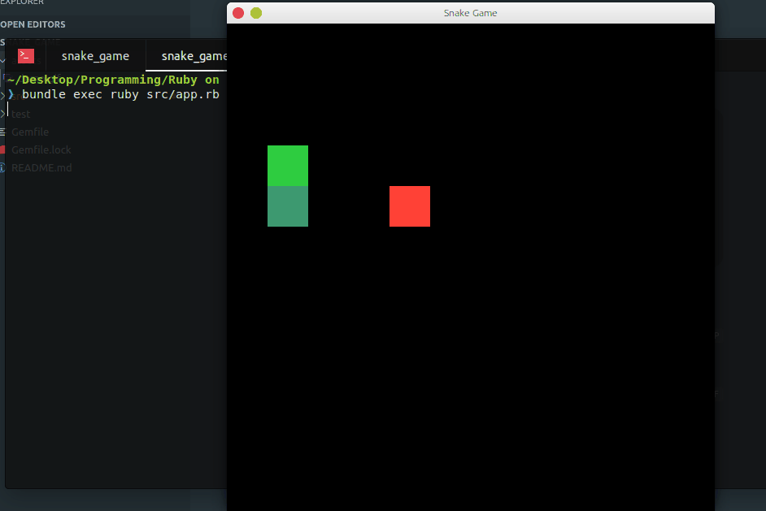

# Snake Game

This game was made with [Ruby 2D](http://www.ruby2d.com/) 

## Usage

- To move: key arrows
- To Pause & Continue: **P** key

## Installation

1. `git clone https://github.com/dmunoz-10/snake_game.git`
2. `cd snake_game && bundle install`
3. `bundle exec ruby test/actions_test.rb`
4. `bundle exec ruby src/app.rb`
